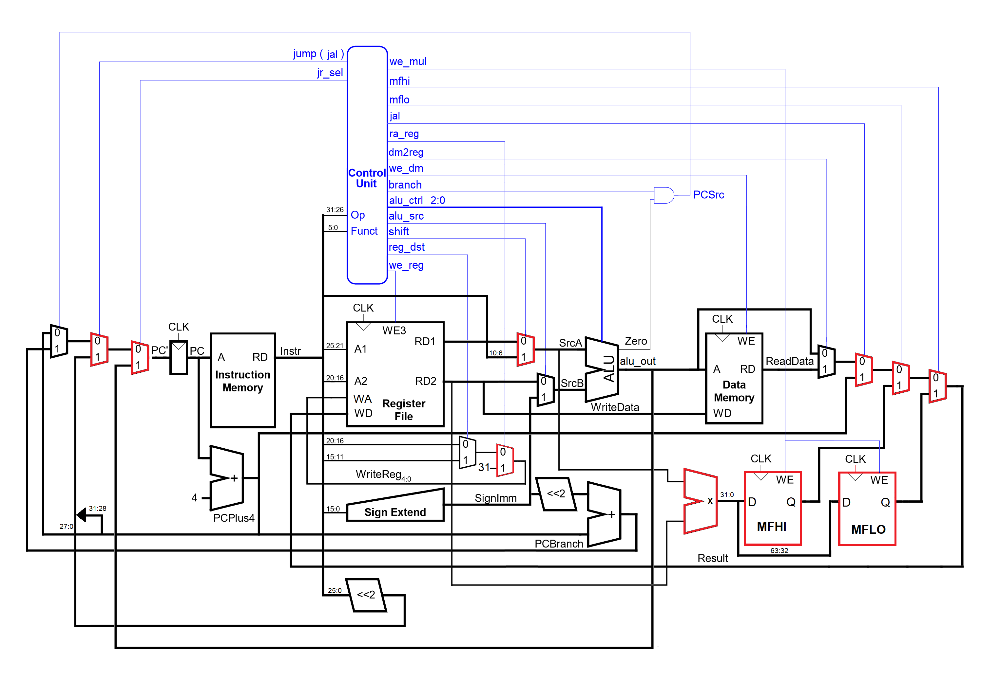

# VHDL
Single Cycle Mips Processor designed with Verilog 

Designed VHDL codebase with FPGA utilization for supporting assembly language programming of the MIPS processor with pipeline.

Implemented SoC, RTL and module hierarchical design methodology. Participated in reviews of specifications, designing test benches, and writing technical reports.

